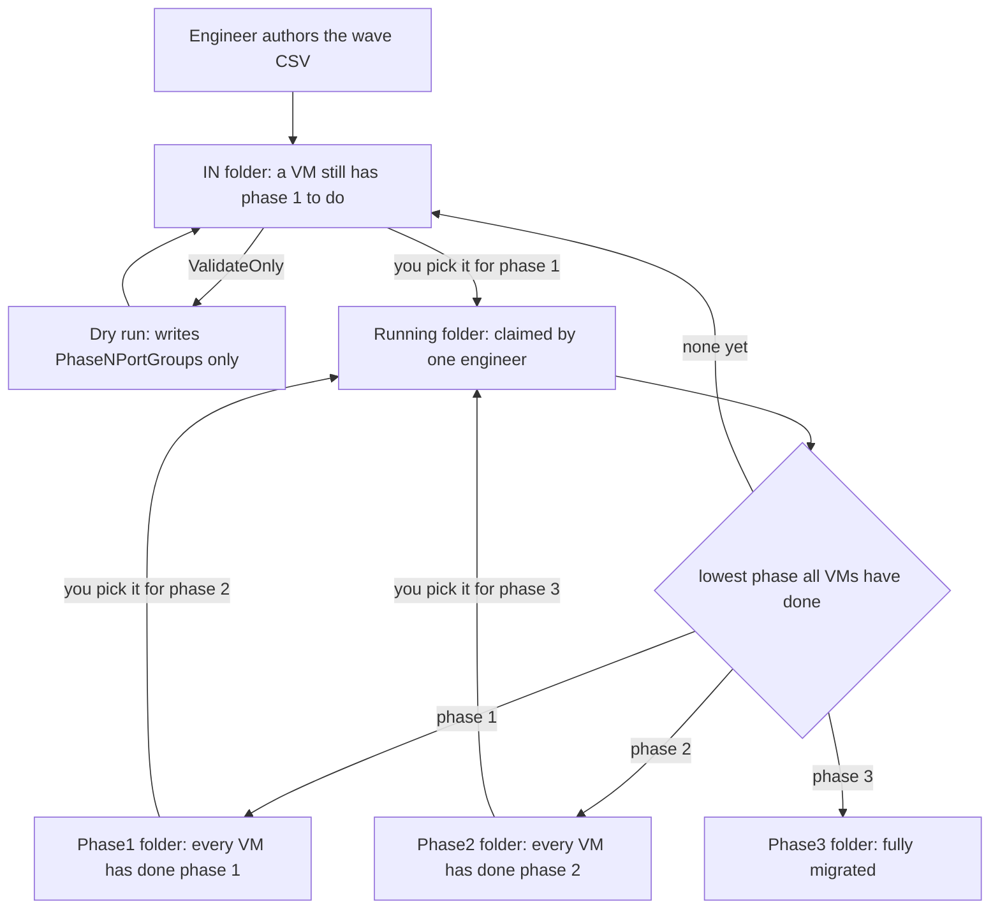
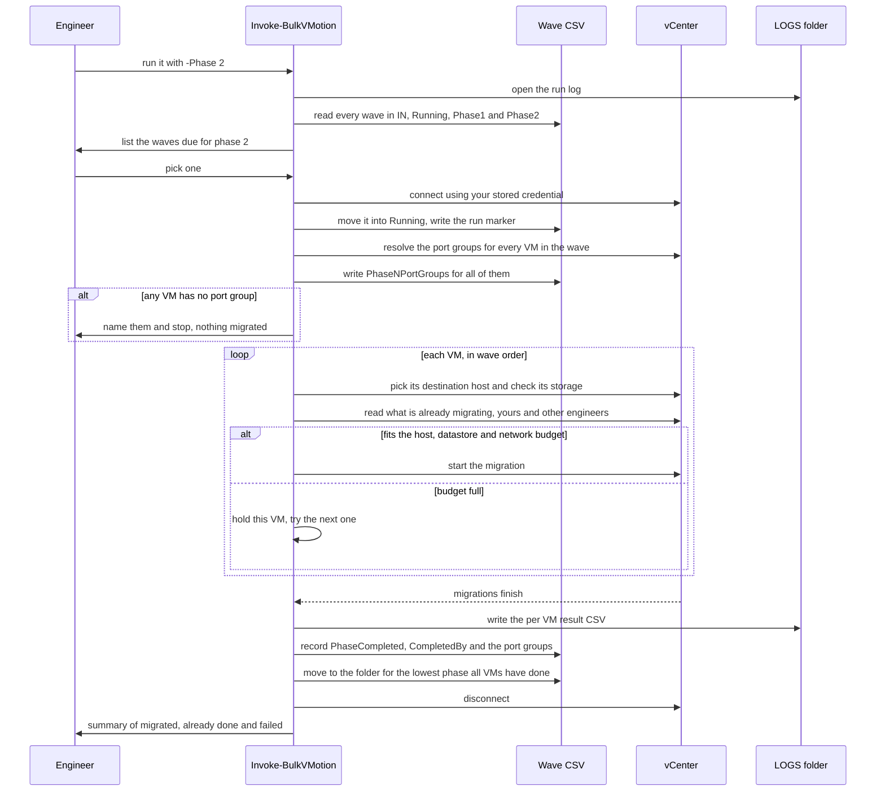

# Bulk vMotion

PowerCLI tooling for migrating VMs in bulk, driven by CSV waves, in the three phases the
move actually happens in:

| Phase | What moves | What does not |
| --- | --- | --- |
| **1** | vMotion from the old cluster to the new one; every network adapter is remapped onto the new VDS by VLAN ID | Storage. The disks stay put, so the new cluster must already see them |
| **2** | Storage vMotion onto the new datastore, thin provisioned | The VM stays on its host and keeps its networking |
| **3** | Cross vCenter vMotion to the new vCenter and cluster; port groups remapped onto that vCenter's VDS by VLAN ID | Storage. The same shared volume is used, so no data moves |

The VMs sit still between phases, sometimes for weeks. Each CSV is a **wave** that records
the phase its VMs have completed and is archived into the matching folder, so **the folder
a file sits in tells you where that wave has got to**.

```
IN/       waves waiting for their next phase
Running/  the wave someone is running right now
Phase1/   waves that have completed phase 1
Phase2/   waves that have completed phase 2
Phase3/   waves that are fully migrated
LOGS/     one .log per run + one result CSV per wave per phase
```

When the next wave is due you just run the next phase and pick the wave from the list -
nothing is moved by hand.

## Before your first run

Two things, once each.

**1. Store your vCenter credentials.** Several engineers share the mgmt server, so
credentials are per engineer rather than in a config file. Run this once per vCenter:

```powershell
.\Save-MigrationCredential.ps1 -VIServer vc.corp.local
.\Save-MigrationCredential.ps1 -VIServer vc-new.corp.local   # phase 3 only
```

The password is encrypted with DPAPI to **your Windows account on that machine**: a
colleague logged into the same server cannot read it, and the file is useless if copied
elsewhere. `-Remove` forgets one. Runs then pick your credential up on their own and
prompt only if there is nothing stored. `-SourceCredential` / `-TargetCredential` still
override everything.

> Windows only. On Linux and macOS PowerShell does not encrypt a SecureString, so saving
> is refused rather than writing your password out in the clear.

**2. Put your site's names in the config.** Copy the sample and edit it:

```powershell
Copy-Item .\docs\samples\settings.json .\config\settings.json
notepad .\config\settings.json
```

Set `SourceVIServer`, `TargetVIServer`, `DefaultTargetCluster` and `TargetVDSwitch` to your
real names. `config/settings.json` is gitignored, so your vCenter and cluster names stay
out of the repository, and every command below works as written without substituting
anything. Anything you pass on the command line still wins over the config.

## The life of a wave file

A wave is one CSV. It carries its own state, so the folder it sits in tells you how far
that wave has got.



No file is ever moved by hand. A wave always sits in the folder matching the lowest phase
**all** of its VMs have completed, and the run works that out from the file itself:

| Folder | Meaning |
| --- | --- |
| `IN/` | at least one VM has not completed phase 1 |
| `Phase1/` | every VM has completed phase 1, at least one has not completed phase 2 |
| `Phase2/` | every VM has completed phase 2 |
| `Phase3/` | fully migrated |

So a phase 2 run lists the waves sitting in `Phase1/` and you pick one. A wave that comes
back with failures returns to the folder it belongs in, and the picker shows how far it
got - `12 VM(s), 8 done` - so you can see there is work outstanding without hunting for
the file. Put a wave in the wrong folder by hand and the next run puts it right.

What gets written, and where:

| When | What is written | Where |
| --- | --- | --- |
| Wave picked | engineer, machine, process id, start time, phase | `Running/<wave>.run.json` |
| Throughout the run | every decision and every migration | `LOGS/bulk-vmotion_<engineer>_<timestamp>.log` |
| A VM completes the phase | `PhaseCompleted`, `CompletedAt`, `CompletedBy`, `ResultVIServer`, `ResultCluster`, `ResultHost`, `ResultDatastore`, and the phase's `PhaseNPortGroups` | the wave CSV, on that VM's row |
| Port groups resolved, before any VM moves | `PhaseNPortGroups` | the wave CSV, every row that resolved |
| Dry run only | `PhaseNPortGroups`, and nothing else | the wave CSV |
| Run ends | one row per VM: status, duration, port groups, failure message | `LOGS/<wave>_phase<N>_<engineer>_result_<timestamp>.csv` |
| Wave released | the run marker is deleted | `Running/` |

The dry run row is the one to remember: it is the only write that happens without the wave
being claimed, and what it writes is what you review before committing to the migration.

## What a run does

One run migrates one wave through one phase. The order matters in a couple of places: the
log is open before anything else, so even a run that fails at the first hurdle leaves a
record; and the wave is only claimed once the vCenter connection is up, so a failed logon
never leaves a wave locked in `Running/`.



The port groups are settled for the **whole wave** before anything moves, and written into
the CSV as they are resolved. If a single VM has no port group the run names it and stops
without migrating anything, so you find out in the first seconds rather than after five VMs
have already moved. The ones that did resolve are already recorded, so you only fix the row
it named.

Picking the destination host stays inside the loop on purpose: it chooses the host with the
most free memory, so doing it for the whole wave up front would aim every VM at the same
host.

`-ValidateOnly` does the same resolving without claiming the wave and without migrating -
useful for a first look, but no longer something you have to do first.

## Phase 1: cluster and VDS

vMotion to the new cluster and remap every NIC onto the new VDS by VLAN. Storage does not
move, so the new cluster must already see the VMs' datastores.

**1. Author the wave.** One row per VM, saved into `IN/` with a name that identifies it,
for example `wave-app-01.csv`:

```csv
VMName,SourceCluster,Phase1Cluster,Phase1VDS,Phase2Datastore,Phase3Cluster,Phase3VDS
vm-app-01,CL-OLD-01,CL-NEW-01,VDS-NEW-01,DSC-NEW-PROD,CL-FINAL-01,VDS-VC2-01
vm-web-01,CL-OLD-01,CL-NEW-01,VDS-NEW-01,DSC-NEW-PROD,CL-FINAL-01,VDS-VC2-01
```

Fill in all three phases now if you know them; each phase reads only its own columns.
Anything left blank falls back to the config. Do not add the port group columns - that is
the script's job.

**2. Dry run, if you want one.** The real run resolves the port groups itself and refuses
to migrate anything unless every VM in the wave resolves, so this step is optional. It is
still worth doing on your first wave, or on one with unfamiliar VLANs, because it lets you
look before anything is claimed:

```powershell
.\Invoke-BulkVMotion.ps1 -Phase 1 -SourceVIServer vc.corp.local -ValidateOnly
```

Nothing is migrated, the wave stays where it is, and no phase is recorded. What it does do
is work out the port group for every NIC and write it into the file.

**3. Check what it resolved.** Open the CSV. A `Phase1PortGroups` column has appeared,
with one entry per adapter:

```csv
VMName,...,Phase1PortGroups,PhaseCompleted
vm-app-01,...,"Network adapter 1=PG-NEW-Prod-100; Network adapter 2=PG-NEW-Bkp-300",0
vm-web-01,...,"Network adapter 1=PG-NEW-Test-200",0
```

Check every VLAN landed where you expect. If one did not, edit the cell - the real run
uses what is in it. `PhaseCompleted` is still `0`, because nothing has happened yet.

The log says the same thing, with the VLAN it matched on:

```
[vm-app-01] Switch      : VDS-NEW-01
[vm-app-01] Network     : Network adapter 1: PG-OLD-Prod-100 (VLAN 100) -> PG-NEW-Prod-100 [VlanId]
[vm-app-01] Network     : Network adapter 2: PG-OLD-Bkp-300 (VLAN 300) -> PG-NEW-Bkp-300 [VlanId]
[vm-app-01] Will change : compute + network
```

**4. Run it.** Same command without `-ValidateOnly` - and this is the only step you
actually need, because it does step 2's resolving itself:

```powershell
.\Invoke-BulkVMotion.ps1 -Phase 1 -SourceVIServer vc.corp.local
```

```
[INFO   ] Wave                     : wave-app-01.csv (2 VM(s))
[INFO   ] Phase                    : 1
[INFO   ] [vm-app-01] Network     : Network adapter 1: PG-OLD-Prod-100 (VLAN 100) -> PG-NEW-Prod-100 [Override]
[INFO   ] [vm-app-01] Network     : Network adapter 2: PG-OLD-Bkp-300 (VLAN 300) -> PG-NEW-Bkp-300 [Override]
[INFO   ] [vm-app-01] Will change : compute + network
[SUCCESS] [vm-app-01] Migration started (task Task-task-1).
[SUCCESS] [vm-app-01] Migration completed in 3.4 minutes.
[INFO   ] Result for wave-app-01.csv phase 1: 2 migrated, 0 already done, 0 failed, 0 skipped.
[INFO   ] Recorded phase 1 for 2 VM(s) in wave-app-01.csv.
[SUCCESS] Wave file is now at ...\Phase1\wave-app-01.csv
```

`[Override]` rather than `[VlanId]` is expected here: it is using the port groups you
approved in step 3.

**5. Afterwards.** The file is in `Phase1/` with the outcome recorded per VM:

```csv
VMName,...,Phase1PortGroups,PhaseCompleted,CompletedAt,CompletedBy,ResultVIServer,ResultCluster,ResultHost,ResultDatastore
vm-app-01,...,"Network adapter 1=PG-NEW-Prod-100; Network adapter 2=PG-NEW-Bkp-300",1,2026-09-01 21:14:02,dsjodin,vc.corp.local,CL-NEW-01,esx-new-03.corp.local,
```

`ResultDatastore` is empty on purpose: phase 1 does not move storage. Leave the file where
it is; the storage wave will list it when you run phase 2.

## Phase 2: storage

Storage vMotion onto the new datastore, thin provisioned. The VMs stay on their hosts and
their networking is not touched. Two per host at a time, eight per datastore.

**1. Nothing to move.** The wave is sitting in `Phase1/` where the phase 1 run left it, and
a phase 2 run lists it for you. The only column phase 2 reads is `Phase2Datastore`; if you
left it blank, fill it in now (the file is in `Phase1/`), or set `DefaultTargetDatastore`
in the config.

**2. Dry run.**

```powershell
.\Invoke-BulkVMotion.ps1 -Phase 2 -SourceVIServer vc.corp.local -ValidateOnly
```

There are no port groups to resolve in phase 2, so this is a validation only: it checks
each VM is where phase 1 left it, the datastore exists and has room for the VM plus the
reserve. Nothing is written to the CSV.

**3. Check what it resolved.**

```
[INFO   ] Phase means              : Storage vMotion only, host and networking untouched
[INFO   ] [vm-app-01] Datastore   : DSC-NEW-PROD
[INFO   ] [vm-app-01] Will change : storage
```

`Will change : storage` is what you want. Phase 2 never moves a VM between hosts, so
compute can never appear here. If a VM instead reports `Nothing to do for phase 2` it is
already on that datastore and will be skipped, which is what you want on a re-run and
worth a second look if it is the first.

**4. Run it.**

```powershell
.\Invoke-BulkVMotion.ps1 -Phase 2 -SourceVIServer vc.corp.local
```

```
[SUCCESS] [vm-app-01] Migration started (task Task-task-1).
[SUCCESS] [vm-app-01] Migration completed in 22.7 minutes.
[INFO   ] Result for wave-app-01.csv phase 2: 2 migrated, 0 already done, 0 failed, 0 skipped.
[SUCCESS] Wave file is now at ...\Phase2\wave-app-01.csv
```

A wave larger than two VMs per host will not start them all at once - that is the cost
model doing its job. Use `-LogLevel Debug` if you want to watch it queue.

**5. Afterwards.** The file is in `Phase2/`, `PhaseCompleted` is `2`, and `ResultDatastore`
now names the datastore each VM landed on.

## Phase 3: cross vCenter

Cross vCenter vMotion to the new vCenter and cluster. The datastore is the same shared
volume, so no data moves - but a VDS cannot span vCenters, so the port groups are remapped
by VLAN a second time.

**1. Nothing to move.** The wave is in `Phase2/` and a phase 3 run lists it. Phase 3 reads
`Phase3Cluster` and `Phase3VDS`.

**2. Dry run, if you want one.** As in phase 1 this is optional; the real run resolves and
refuses to move anything unless the whole wave resolves. It needs both vCenters:

```powershell
.\Invoke-BulkVMotion.ps1 -Phase 3 -SourceVIServer vc.corp.local -TargetVIServer vc-new.corp.local -ValidateOnly
```

As in phase 1, it writes the port groups it resolved - into `Phase3PortGroups` this time,
leaving the phase 1 column alone as the record of that wave.

**3. Check what it resolved.**

```
[INFO   ] Phase means              : cross vCenter vMotion, same shared datastore, port groups remapped
[INFO   ] Target vCenter           : vc-new.corp.local
[INFO   ] [vm-app-01] Datastore   : DSC-NEW-PROD
[INFO   ] [vm-app-01] Switch      : VDS-VC2-01
[INFO   ] [vm-app-01] Network     : Network adapter 1: PG-NEW-Prod-100 (VLAN 100) -> PG-VC2-Prod-100 [VlanId]
[INFO   ] [vm-app-01] Network     : Network adapter 2: PG-NEW-Bkp-300 (VLAN 300) -> PG-VC2-Bkp-300 [VlanId]
[INFO   ] [vm-app-01] Will change : compute + network
```

`Will change : compute + network` with no storage is the point of phase 3: the disks stay
on the volume they are on. That is not something to eyeball, it is enforced - if the VM's
datastore does not exist on the new vCenter under the same name, the VM is failed rather
than copied:

```
[ERROR  ] [vm-app-01] Datastore 'DSC-NEW-PROD' was not found on vc-new.corp.local. Phase 3
          expects the same shared storage to be presented to both vCenters.
```

Seeing that means the storage is not genuinely presented to both sides. Stop and fix the
presentation; do not work around it in the CSV.

**4. Run it.**

```powershell
.\Invoke-BulkVMotion.ps1 -Phase 3 -SourceVIServer vc.corp.local -TargetVIServer vc-new.corp.local
```

**5. Afterwards.** The file is in `Phase3/` and the wave is done. Both port group columns
are kept, so the file is the full record of where every NIC has been:

```csv
VMName,...,Phase1PortGroups,PhaseCompleted,...,ResultVIServer,ResultCluster,ResultHost,ResultDatastore,Phase3PortGroups
vm-app-01,...,"Network adapter 1=PG-NEW-Prod-100; Network adapter 2=PG-NEW-Bkp-300",3,...,vc-new.corp.local,CL-FINAL-01,esx-vc2-01.corp.local,DSC-NEW-PROD,"Network adapter 1=PG-VC2-Prod-100; Network adapter 2=PG-VC2-Bkp-300"
```

## Picking a wave

Every command above shows you the waves due for that phase, and you pick one:

```
Waves available for phase 1
------------------------------------------------------------------------------------------------
 1. wave-app-01.csv                      12 VM(s)  phase 1  Ready
 2. wave-db-02.csv                        8 VM(s)  phase 1  Interrupted - CORP\bob started phase 1 at 09:14, then the process is gone
    wave-web-03.csv                      20 VM(s)  phase 1  Busy - CORP\alice started phase 1 at 10:02 (still running)
    wave-app-04.csv                       6 VM(s)  phase 2  NotDue - due for phase 2
------------------------------------------------------------------------------------------------
Which wave? (number, or Q to quit):
```

Only numbered lines can be picked. The wave you choose moves into `Running/` with a marker
naming you, your machine and the process, so nobody else can start it. When the run ends it
goes to `Phase{N}` (all done) or back to `IN` (something outstanding) - including if the run
crashes, because the release happens in the script's `finally`.

`-CsvFile .\IN\wave-app-01.csv` names a wave directly and skips the picker.
`-NonInteractive` never prompts: it runs the only available wave, or fails if there is more
than one. Both are for scripted runs.

## When a run does not go cleanly

**A VLAN matches two port groups on the target VDS.** The VM is failed rather than guessed
at:

```
[ERROR  ] [vm-app-01] VLAN 100 matches several target port groups (PG-A-100, PG-B-100).
          Set the port group for this adapter in the PhaseNPortGroups column, or add an
          entry to the port group exception map.
```

Fix: put the port group you want in that VM's `Phase1PortGroups` / `Phase3PortGroups` cell
and run the phase again. If the same pair of port groups affects every wave, add a row to
`config/portgroup-exceptions.csv` instead and it is handled everywhere.

**The run stopped and migrated nothing.** Every VM's port groups are resolved before the
wave moves, and one of them could not be:

```
[SUCCESS] Resolved and recorded the port groups for 2 VM(s) in Phase1PortGroups.
[ERROR  ] 1 of 3 VM(s) have no port group, so nothing in this wave was migrated:
[ERROR  ] [vm-dmz-01] No target port group carries VLAN 999 (source port group 'PG-OLD-DMZ-999').
[WARNING] Name the port group for those VM(s) in the Phase1PortGroups column of
          wave-app-01.csv and run phase 1 again. The rest of the wave is already resolved
          and recorded.
```

This is deliberate: a wave is all or nothing, so you never get half of one migrated and
half not. Fix is below, and note the second line - the VMs that did resolve already have
their port groups written, so only the named row needs touching.

**No port group carries the VLAN at all.**

```
[ERROR  ] [vm-dmz-01] No target port group carries VLAN 999 (source port group 'PG-OLD-DMZ-999').
```

Fix: the VLAN is missing from the new VDS. Create it, or name an existing port group in the
CSV cell.

**Phase 1: the destination cannot see the VM's storage.**

```
[ERROR  ] [vm-nosan-01] Datastore 'DS-ISOLATED' is not mounted on the destination host
          'esx-new-02.corp.local'. Phase 1 does not move storage, so the VM cannot run there.
```

Fix: present the datastore to the new cluster, or take this VM out of the phase 1 wave and
move it another way. Phase 1 deliberately never moves disks.

**The wave came back to IN with some VMs done.** This is normal, not a failure of the run:

```
[INFO   ] Result for wave-app-01.csv phase 1: 1 migrated, 0 already done, 2 failed, 0 skipped.
[WARNING] 'wave-app-01.csv' goes back to IN (2 failed, 0 skipped). Correct the failing rows
          and run phase 1 again - the VMs that are done will be skipped.
```

A wave only moves on once every row has reached the phase, so it stays in the folder for
the phase all of its VMs have completed - `IN/` here, because some VMs have not finished
phase 1. The rows that succeeded already carry `PhaseCompleted,1`:

```csv
vm-app-01,...,1,2026-09-01 15:26:26,dsjodin,vc.corp.local,CL-NEW-01,esx-new-02.corp.local,,"Network adapter 1=PG-NEW-Prod-100"
vm-dmz-01,...,0,,,,,,,
```

Fix: correct the failing rows and run the same phase again. The finished VMs are reported
`AlreadyDone` and skipped without being touched. Do not delete them from the file.

**A wave is stuck in Running after a lost RDP session.** It appears in the picker as
`Interrupted - CORP\bob started phase 1 at 09:14, then the process is gone`, and is
selectable. Picking it resumes the wave; VMs that got through are skipped. A wave claimed
from a *different* machine cannot be checked from here, so it shows as `Busy`; use
`-TakeOver` only when you know that run is really gone.

**A VM sits there not starting.** It is waiting for capacity. Run with `-LogLevel Debug` and
the reason is logged:

```
[DEBUG  ] [vm-app-03] Waiting for capacity: host 'esx-new-01.corp.local' is at 8 of 8 migration cost.
```

That is the cost model, not a fault - it clears as running migrations finish. See
[Concurrency](#concurrency).

## The CSV

You author these columns. Only `VMName` is required; anything blank falls back to the
run's `-DefaultTargetCluster` / `-DefaultTargetDatastore` / `-TargetVDSwitch`.

| Column | Phase | Meaning |
| --- | --- | --- |
| `VMName` | all | Name of the VM in the source vCenter |
| `SourceCluster` | all | Only needed to disambiguate a duplicated VM name |
| `Phase1Cluster` | 1 | Destination cluster |
| `Phase1VDS` | 1 | Distributed switch this VM lands on |
| `Phase2Datastore` | 2 | Datastore or datastore cluster to move onto |
| `Phase3Cluster` | 3 | Cluster on the new vCenter |
| `Phase3VDS` | 3 | Distributed switch on the new vCenter |
| `Notes` | - | Free text, never touched |

The script fills these in - do not write them by hand:

| Column | Meaning |
| --- | --- |
| `Phase1PortGroups`, `Phase3PortGroups` | The port group chosen for **every** adapter: `Network adapter 1=PG-Prod-100; Network adapter 2=PG-Bkp-300` |
| `PhaseCompleted` | 0, 1, 2 or 3. Drives what runs next |
| `CompletedAt`, `CompletedBy` | When, and which engineer |
| `ResultVIServer`, `ResultCluster`, `ResultHost`, `ResultDatastore` | Where the VM actually landed |

`Phase1Host` / `Phase3Host` also work if you ever need to pin a VM to one host instead of
letting the script choose.

`docs/samples/wave1.csv` is a wave as you would author it;
`docs/samples/wave1-after-phase1.csv` is the same file after a phase 1 run.

## Port groups, VLANs and multiple NICs

For every adapter of every VM, in phases 1 and 3:

1. the port group it is on is read from the adapter backing (by port group key, so a
   duplicated port group name cannot cause a mismatch),
2. its VLAN is read from the port group configuration,
3. the port group on that VM's target VDS carrying the same VLAN is chosen.

A VM with several NICs on different VLANs is handled per adapter - each lands on the port
group for its own VLAN, and all of them are recorded in one cell.

Access VLANs, trunk ranges and private VLANs are kept apart: a trunk never matches a plain
access VLAN. If a VLAN exists on **more than one** port group of the target switch, the VM
is failed rather than guessed at, unless one candidate has exactly the same name as the
source port group.

**This is what the dry run is for.** `-ValidateOnly` writes the port groups it resolved
into `PhaseNPortGroups` without migrating anything. Open the file, check every NIC landed
where you expect, correct anything ambiguous, and the real run uses what is in the cell.
`config/portgroup-exceptions.csv` does the same thing globally, by source port group name.

## Concurrency

Rather than a flat limit, the tool applies vSphere's own resource cost model, so it never
asks vCenter for something vCenter would only queue:

| Resource | Maximum | vMotion costs | Storage vMotion costs |
| --- | --- | --- | --- |
| Host | 8 | 1 | 4 |
| Datastore | 128 | 1 | 16 against each of source and destination |
| vMotion network | 8 | 1 | - |

Which gives the familiar derived limits: **8 vMotions or 2 Storage vMotions per host**, and
**8 Storage vMotions per datastore**. When a VM has to wait, the log says which resource is
full.

Migrations *other engineers* have started are counted too: the running relocate tasks are
read from vCenter each polling cycle and charged against the same budget, so two people
running waves at once share the estate properly. That accounting is deliberately
approximate and errs high - another session's destination is not readable, so only the
source host is charged, and a relocate is costed as a Storage vMotion. `-IgnoreExternalTasks`
turns it off.

> **Network speed:** VMware tiers the network limit at 1GigE (max 4) and 10GigE (max 8)
> only - there is no higher tier, so 10GigE, 25GigE and 100GigE all cap at 8, and the host
> limit of 8 binds first anyway. Leave `-VMotionNetworkLimit` at 8 unless your vMotion
> network is 1GigE, in which case set it to 4.

## Parameters worth knowing

| Parameter | Default | Purpose |
| --- | --- | --- |
| `-Phase` | from the wave | Which phase this run is; only waves due for it can be picked |
| `-ValidateOnly` | off | Resolve everything and fill in the port groups, migrate nothing |
| `-VMotionNetworkLimit` | 8 | Set to 4 only on a 1GigE vMotion network |
| `-IgnoreExternalTasks` | off | Do not count other engineers' migrations against the budget |
| `-MigrationTimeoutMinutes` | 120 | A VM is reported `TimedOut` after this; the vCenter task keeps running |
| `-StopOnError` | off | Stop starting new migrations as soon as one VM fails |
| `-DatastoreReserveGB` | 100 | Free space that must remain on the target datastore (phase 2) |
| `-DiskStorageFormat` | `Thin` | Applied only when disks actually move |
| `-CsvFile` | - | Run this wave and skip the picker |
| `-NonInteractive` | off | Never prompt; run the only available wave or fail |
| `-TakeOver` | off | Take a wave another engineer's run still claims. Be sure their run is really gone |
| `-ArchiveRoot` | script folder | Where `Running/` and `Phase1..3/` live |
| `-IgnoreInvalidCertificate` | off | For vCenters with self-signed certificates |
| `-WhatIf` | off | Plan everything and report, without migrating |

Exit codes: `0` everything succeeded, `1` at least one VM failed, `2` the run itself
stopped (connection failure, bad wave, blocked by a limit).

## What is checked before a VM is touched

A VM is only migrated once all of this resolves - otherwise it is reported `Failed`, the
wave goes back to `IN`, and the run continues with the next VM:

* the VM exists and its name is unambiguous
* no pending vCenter question on the VM
* the destination cluster has a connected host (or the named host is connected)
* **phase 1**: every datastore the VM uses is mounted on the destination host - storage
  does not move in phase 1, so a host that cannot see the disks would fail the vMotion
* **phase 2**: the datastore exists and has room for the VM plus the reserve
* **phase 3**: the VM's datastore exists on the new vCenter under the same name, which is
  what "the same shared volume" means in practice
* **phases 1 and 3**: every network adapter resolves to exactly one target port group

Powered-off VMs are migrated as a cold relocate and logged as such. Work that is not
needed is not done: a VM already in the target cluster keeps the host DRS gave it, and a VM
that only needs its port groups changed is reconnected with `Set-NetworkAdapter` rather
than sent through a pointless relocate.

VM folder placement is not settable - VMs land in the default folder on the new vCenter.

## Logging

Each run writes `LOGS/bulk-vmotion_<engineer>_<timestamp>.log` with the VLAN table of every
switch used, the full plan for each VM (source, destination, datastore, switch, per adapter
port group mapping, and a `Will change` line naming compute/storage/network), migration
progress and a closing summary. Per wave and phase,
`LOGS/<wave>_phase<N>_<engineer>_result_<timestamp>.csv` records one row per VM with status,
duration, port groups and any failure message. Use `-LogLevel Debug` to also see why a VM
is waiting for capacity.

## Tests

```powershell
Invoke-Pester -Path .\Tests
```

`Tests/BulkVMotion.Tests.ps1` covers VLAN parsing, port group matching and lists, the phase
state machine, CSV write-back, the cost model, wave state and credentials.
`Tests/Invoke-BulkVMotion.Tests.ps1` runs the real script end to end against the PowerCLI
test doubles in `Tests/Fakes` - multi-NIC VMs, per-VM switches, the Running lifecycle
including a crashed run, concurrency ceilings, and one wave carried through all three
phases. No vCenter is needed and neither suite touches a live environment.

## Layout

```
Invoke-BulkVMotion.ps1              the runner
Save-MigrationCredential.ps1        one-time per engineer credential setup
Modules/BulkVMotion/                logging, CSV and phase handling, VLAN mapping,
                                    admission control, wave picker, migration
config/                             settings.json and portgroup-exceptions.csv (gitignored)
docs/samples/                       sample waves, config and exception map
Tests/                              Pester tests and the PowerCLI test doubles
```
